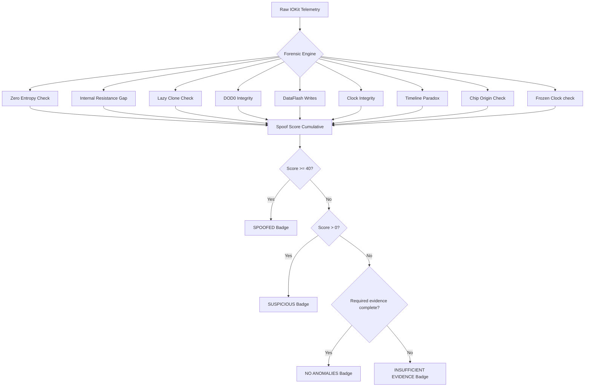

# Battery Guardian: Detecting Counterfeit MacBook Batteries Through Software Forensics

**Author:** Daniel Jesusegun ([@Dannyjay-hub](https://github.com/Dannyjay-hub))
**Repository:** [github.com/Dannyjay-hub/Battery-Guardian-for-Mac](https://github.com/Dannyjay-hub/Battery-Guardian-for-Mac)

---

## Abstract

Battery Guardian is a native macOS application that detects counterfeit, reprogrammed, or spoofed MacBook batteries using software-only forensic analysis. The tool exploits the fact that Apple MacBooks communicate with their batteries through a Texas Instruments (TI) gas gauge chip via the SMBus protocol, and that macOS exposes this raw chip telemetry through the I/O Registry. By analyzing statistical anomalies in voltage signals, internal lifetime timers, cell capacity variance, and non-volatile flash memory write counts, Battery Guardian distinguishes a genuine Apple battery from a counterfeit one, without ever opening the laptop.

Initially prototyped as a Python/pywebview script, Battery Guardian has been rewritten as a 100% native SwiftUI desktop application. This article covers the forensic science, the detection algorithms, the native implementation details (interfacing with `IOKit` directly in Swift), and the engineering decisions behind shipping a production-ready hardware security utility.

---

## 1. The Problem: You Can't Trust Your Battery Percentage

When a third-party repair shop replaces a MacBook battery, the replacement cell may come with a reprogrammed Battery Management System (BMS) chip. These chips are flashed to report fake health metrics (0 cycles, 100% capacity, no wear) so that macOS displays a clean "Battery Condition: Normal" badge. The user has no way of knowing whether the battery reporting perfect health is actually genuine, or a degraded third-party cell with a spoofed controller.

This matters because:

* **Safety**: A counterfeit BMS won't trigger thermal shutdowns or overvoltage protections correctly.
* **Reliability**: The battery percentage becomes meaningless; the cell can die at "40%" without warning.
* **Longevity**: Without real impedance tracking, the OS cannot manage charging cycles to extend battery life.

Battery Guardian was born from a personal investigation: the author's own MacBook had a third-party battery installed by a repair shop, and the goal was to definitively prove whether it was genuine or spoofed, using only software.

---

## 2. The Science: How Apple Battery Chips Work

### 2.1 The TI Gas Gauge

Apple uses Texas Instruments Impedance Track™ gas gauge chips (notably the `bq20z80`, `bq20z451`, and `bq40z` families) in MacBook batteries [1]. These chips are not simple voltage readers; they are sophisticated microcontrollers that:

1. **Measure** individual cell voltages, current, and temperature continuously.
2. **Calculate** `Qmax` (maximum chemical capacity) using electrochemical impedance spectroscopy [1, §5.1].
3. **Track** `TotalOperatingTime`, `CycleCount`, and `DataFlashWriteCount` in non-volatile flash memory [1, §4.7].
4. **Communicate** over SMBus (System Management Bus) with the host system [1, §3].

### 2.2 The I/O Registry (`IOKit`)

On macOS, the kernel exposes battery telemetry via `IOKit`. In the command line, this can be observed via `ioreg -l -w0 -r -c AppleSmartBattery`. In a native environment, we can query this registry directly. The registry exposes raw registers nested within three levels:

```
AppleSmartBattery (Top-Level)
└── BatteryData (TI Register Dictionary)
    └── LifetimeData (Sensor History Odometer)
```

Here are the key registers parsed by Battery Guardian:

| Register | Location | What It Reveals |
|:---|:---|:---|
| `Qmax` | `BatteryData` | Array of maximum chemical capacity per cell (mAh) |
| `CycleCount` | Top-Level | Number of full charge/discharge cycles |
| `DataFlashWriteCount` | `BatteryData` | Total flash memory writes (internal odometer) |
| `TotalOperatingTime` | `LifetimeData` | Cumulative hours the chip has been powered |
| `CellVoltage` | `BatteryData` | Individual cell voltages in millivolts |
| `DOD0` | `BatteryData` | Depth of Discharge calibration offsets |
| `DesignCapacity` | `BatteryData` | Factory-specified capacity (mAh) |
| `AppleRawMaxCapacity` | Top-Level | Current usable capacity (mAh) |
| `PermanentFailureStatus`| Top-Level | Safety kill-switch flags |

### 2.3 What Counterfeiters Do

A typical spoofed battery replaces the genuine TI chip (or reflashes it using specialized hardware programming tools like an EV2400) to:

* **Hard-code** `Qmax` to equal `DesignCapacity` (faking 100% health forever).
* **Zero out** `CycleCount` (claiming the battery is brand new).
* **Freezes** `TotalOperatingTime` (preventing the OS from knowing the battery's age).
* **Copies** `DesignCapacity` into `DOD0` (a calibration register that should never equal capacity).
* **Resets** the cycle count but fails to clear the hardware odometers like `DataFlashWriteCount`.

---

## 3. The Investigation: Building the Evidence

### 3.1 The Suspect Battery

The investigation began with the author's own MacBook, suspected of having a counterfeit battery installed by a third-party repair shop. Initial telemetry dumps revealed anomalies: identical `Qmax` values across all cells, and a `TotalOperatingTime` that never changed between readings.

### 3.2 The Control Group

To establish what "normal" looks like, battery telemetry was collected from a known-genuine MacBook (a friend's MacBook Pro, codenamed "Ebuka's Mac") over a 5-day period (January 22–27, 2026). Additional control data was gathered from other genuine MacBooks ("Caleb's Mac" and "Kuldek's Mac").

Key findings from the control group:

| Metric | Genuine Behavior | Counterfeit Behavior |
|:---|:---|:---|
| **Voltage** | Fluctuates every reading (±3-7 mV) | Exact same value for minutes/hours |
| **TotalOperatingTime** | Increases by 24 units/day | Never changes (frozen at some value) |
| **Qmax variance** | Cells differ by 10-50 mAh | All cells report identical capacity |
| **DataFlashWriteCount** | Proportional to CycleCount (~14:1 ratio) | High writes but near-zero cycles |

### 3.3 The Smoking Guns

Two behaviors were identified that **never** occur in genuine Apple batteries:

1. **The Capacity Flatline (Zero Entropy)**: A real lithium cell's chemical capacity updates independently. Real cells always show slight variations due to manufacturing differences and uneven temperature exposure across the pack. A spoofed chip broadcasts identical capacities because they are hardcoded.
2. **The Time Freeze**: The genuine TI chip updates `TotalOperatingTime` in 24-hour batch increments, which functions as a discoverable "heartbeat." The suspect battery's timer never moved. Counterfeiters freeze this counter to prevent the Mac from calculating the battery's true age.

---

## 4. The Detection Algorithm

Battery Guardian models nine forensic signals under a versioned gauge profile. Only checks marked active for the detected profile can contribute to the score; observation-only signals are retained for research without classifying the battery. A cumulative score ≥ 40 currently triggers a `SPOOFED` verdict.



### 4.1 Physics Violation: Zero Entropy (40 points)

Real lithium cells always develop individual variance (due to chemical aging, impedance differences, and thermal gradients across the pack). Zero variance in a used battery is a statistical impossibility.

```swift
let variance = (qmax.max() ?? 0) - (qmax.min() ?? 0)
if variance == 0 && cycles > 5 {
    // FAIL: All cells report identical capacity.
}
```

### 4.2 Internal Resistance Gap (25 points)

As cells age, their internal resistance grows. This creates an impedance gap between chemical capacity (`Qmax`) and actual usable capacity (`AppleRawMaxCapacity`). If a used battery claims no gap, it is spoofed.

```swift
let gapPct = Double(qmaxRaw - fccRaw) / Double(dc) * 100
if gapPct < 1 && cycles > 30 {
    // FAIL: Suspiciously low impedance gap.
}
```

### 4.3 Firmware Hack: Lazy Cloning (30 points)

The most common counterfeiter trick is to copy the factory `DesignCapacity` into the active `Qmax` registers to force macOS to display "100% Health". In a genuine battery, these values diverge after a few cycles.

```swift
if qmax[0] == designCap && cycles > 5 {
    // FAIL: Qmax is hardcoded to DesignCapacity.
}
```

### 4.4 DOD0 Calibration Integrity (30 points)

`DOD0` (Depth of Discharge at charge termination) is stored in the chip's memory. In a genuine battery, a complete discharge calibration never lands exactly on the design specification. If `DOD0` matches the design capacity exactly, it is a fabricated profile.

Additionally, on older Intel BMS chips, a firmware reset forces all three cells to report `16384` (100% discharged in TI internal units) while showing zero DataFlash writes.

```swift
if dod[0] == 16384 && dod[1] == 16384 && dod[2] == 16384 && writes == 0 && cycles > 5 {
    // FAIL: BMS Chip Reset Detected.
} else if dod[0] == designCap {
    // FAIL: Fabricated DOD0 calibration profile.
}
```

### 4.5 DataFlash Odometer (25 points)

A genuine battery management chip writes calibration values to non-volatile DataFlash continuously. Zero writes on a battery with cycles indicates the odometer has been reset or the chip replaced.

```swift
if dataFlashWriteCount == 0 && cycles > 10 {
    // FAIL: Zero write history on active battery.
}
```

### 4.6 Clock Integrity (50 points)

The chip maintains two independent timers: `TemperatureSamples` (taken every 225 seconds) and `TotalOperatingTime` (in hours). Because they run on different clock loops, they must correlate. A large discrepancy proves one of the timers has been reset.

```swift
let impliedHours = Double(tempSamples) * 225.0 / 3600.0
let discrepancy = abs(impliedHours - Double(operatingTime)) / max(impliedHours, Double(operatingTime)) * 100
if discrepancy >= 20 && tempSamples >= 500 {
    // FAIL: Clock discrepancy indicates tampering.
}
```

### 4.7 Calibration Timeline Paradox (50 points)

The chip logs the cycle count at which the last `Qmax` calibration occurred (`CycleCountLastQmax`). If this value exceeds the current `CycleCount`, it means the cycle counter was rolled back while the calibration log was left untouched.

```swift
if cycleCountLastQmax > cycleCount {
    // FAIL: Calibration occurs in the future.
}
```

### 4.8 Chip Origin (30 points)

MacBook Pro packs are 3-cell stacks. The minimum Cell Undervoltage Protection (CUV) floor for a 3-cell stack is 9,000mV (3,000mV per cell). If the lifetime `MaximumPackVoltage` is below 9,000mV, the chip originally belonged to a 2-cell device (like an iPad or older MacBook Air) and was transplanted.

```swift
if maximumPackVoltage < 9000 {
    // FAIL: Chip belonged to a different device class.
}
```

### 4.9 Frozen Clock (40 points)

By comparing the current scan against previous scans logged in the database, Battery Guardian checks if `TotalOperatingTime` has advanced. A real clock increments whenever the system is on; a frozen clock indicates spoofed firmware.

---

## 5. Architecture and Implementation

### 5.1 Native Swift Shift

While the early iterations of Battery Guardian utilized a Python backend wrapped in a `pywebview` WebKit GUI, version 2.0 is written entirely in Swift. This transition eliminated several constraints:
* **Zero Dependency Overhead**: No need for a packaged Python interpreter, reducing binary size from ~10MB to less than 1.5MB.
* **Direct Sandbox Access**: Avoids invoking shell subprocesses like `ioreg`, instead talking directly to macOS system frameworks.
* **Apple Silicon Native**: Full native execution on arm64 and x86_64 architecture with zero translation layers.

```
┌────────────────────────────────────────────────────────┐
│                   SwiftUI Frontend                     │
│    ContentView · HealthRingView · Log & History Views  │
├────────────────────────────────────────────────────────┤
│                   ScanState Model                      │
│        @Observable state container for views           │
├────────────────────────────────────────────────────────┤
│           ForensicEngine.swift (Analysis)              │
│       Runs 8 forensic checks on raw battery data       │
├────────────────────────────────────────────────────────┤
│           BatteryService.swift (Hardware)              │
│      Direct IOKit C-bindings to AppleSmartBattery      │
└────────────────────────────────────────────────────────┘
```

### 5.2 Interfacing with IOKit in Swift

To bypass shell commands, Battery Guardian queries the macOS Kernel I/O Registry directly. We locate the `AppleSmartBattery` service and create a dictionary of its properties:

```swift
import Foundation
import IOKit

class BatteryService {
    static func read() throws -> BatteryData {
        let service = IOServiceGetMatchingService(
            kIOMainPortDefault,
            IOServiceMatching("AppleSmartBattery")
        )
        guard service != IO_OBJECT_NULL else { throw BatteryError.noBattery }
        defer { IOObjectRelease(service) }

        var props: Unmanaged<CFMutableDictionary>?
        let result = IORegistryEntryCreateCFProperties(service, &props, kCFAllocatorDefault, 0)
        guard result == KERN_SUCCESS, let cfDict = props?.takeRetainedValue() else {
            throw BatteryError.readFailed
        }

        let topLevel = cfDict as NSDictionary as! [String: Any]
        let batteryData = topLevel["BatteryData"] as? [String: Any] ?? [:]
        let lifetimeData = batteryData["LifetimeData"] as? [String: Any] ?? [:]

        return BatteryData(topLevel: topLevel, batteryData: batteryData, lifetimeData: lifetimeData)
    }
}
```

### 5.3 Solving the IOKit Array Type Bug

During development of the Swift port, we uncovered a critical mismatch in how Swift decodes IOKit structures compared to Python. In Python's `plistlib`, numerical arrays like `Qmax` and `DOD0` are implicitly cast to native integer lists.

In Swift, casting these values directly using `as? [Int]` silently failed and returned `nil`. This was because the dictionary returned by IOKit contains arrays of `NSNumber` (specifically 16-bit integers). Attempting a direct cast caused all forensic checks relying on these arrays to fail.

The fix was to explicitly map the array elements:

```swift
struct BatteryData {
    let batteryData: [String: Any]

    // Direct cast failed. Correct implementation:
    var qmax: [Int]? {
        (batteryData["Qmax"] as? [NSNumber])?.map { $0.intValue }
    }

    var dod0: [Int]? {
        (batteryData["DOD0"] as? [NSNumber])?.map { $0.intValue }
    }
}
```

### 5.4 State Management and UI

Using SwiftUI with `ObservableObject`, the application handles updates reactively:

* **Auto-scan**: On window display, the app triggers a thread-safe call to `BatteryService.read()`.
* **State Updates**: Updates progress indicators, updates the circular SwiftUI `HealthRingView`, and fills the metrics cards.
* **Logs & Reports**: Allows users to export structured logs or compile a styled report PDF using a dedicated `ReportGenerator`.

---

## 6. Distribution: Building and Signing

For a security utility like Battery Guardian to run on modern macOS, it must comply with Gatekeeper requirements.

### 6.1 Xcode Configuration

We use `XcodeGen` to maintain a declarative `project.yml` file, compiling the application as a standard bundle. The target configurations enforce standard production options:
* **Minimum Deployment**: macOS 14.0
* **Swift Language Version**: 6.0
* **Entitlements**: Restricts network access to ensure user battery telemetry remains strictly local and private.

### 6.2 Code Signing & Notarization

To build a release that runs without security alerts, the app is signed using a Developer ID Application certificate:

```bash
# Code sign the compiled .app bundle
codesign --force --options runtime --sign "Developer ID Application: DANIEL ADEJESU JESUSEGUN (AH2HL6S8CD)" "Battery Guardian.app"
```

Once signed, the bundle is archived, zipped, and sent to Apple's Notarization Service using `xcrun notarytool` to secure a Gatekeeper ticket before packaging into a compressed DMG installer.

---

## 7. Conclusion

Battery Guardian demonstrates that meaningful hardware forensics can be performed entirely in software, by understanding the underlying chip architecture. The macOS I/O Registry provides a rich window into the battery's internal state, and the behavioral differences between genuine TI gas gauge chips and cheap counterfeit BMS controllers are statistically unmistakable.

The core insight remains: **a real battery is alive, and a fake one is frozen**. Genuine cells show voltage fluctuations, timer heartbeats, and gradual capacity drift. Counterfeit chips report perfect, unchanging numbers, and that perfection is itself the evidence.

---

## References

[1] Texas Instruments. *bq20z80-V110 + bq29330, bq20z90-V110 + bq29330 Technical Reference Manual.* SLUU276. Texas Instruments Incorporated, 2008. Available: [https://www.ti.com/lit/ug/sluu276/sluu276.pdf](https://www.ti.com/lit/ug/sluu276/sluu276.pdf)

[2] Texas Instruments. *bq40z651 1-Series, 2-Series, 3-Series, and 4-Series Li-Ion Battery Pack Manager Technical Reference Manual.* SLUUA42. Texas Instruments Incorporated, 2014. Available: [https://www.ti.com/product/BQ40Z651](https://www.ti.com/product/BQ40Z651)

[3] Texas Instruments. *bq20z40-R1 and bq20z45-R1 Technical Reference Manual.* SLUU313A. Texas Instruments Incorporated, 2012. Available: [https://www.ti.com/lit/ug/sluu313a/sluu313a.pdf](https://www.ti.com/lit/ug/sluu313a/sluu313a.pdf)

[4] Texas Instruments. *Theory and Implementation of Impedance Track™ Battery Fuel-Gauging Technology.* SLUA364B. Texas Instruments Incorporated, 2005. Available: [https://www.ti.com/lit/an/slua364b/slua364b.pdf](https://www.ti.com/lit/an/slua364b/slua364b.pdf)

[5] Texas Instruments. *Battery Authentication Protocol and Design.* SLUA908. Texas Instruments Incorporated, 2018. Available: [https://www.ti.com/lit/an/slua908/slua908.pdf](https://www.ti.com/lit/an/slua908/slua908.pdf)

> Key sections referenced: §3 (SMBus Communication), §4.7 (Data Flash), §5.1 & §5.3 (Impedance Track™ Algorithm and Qmax), §5.1.3 & §5.4 (DOD0 Calibration), Subclass 96 (Permanent Failure Flags).
